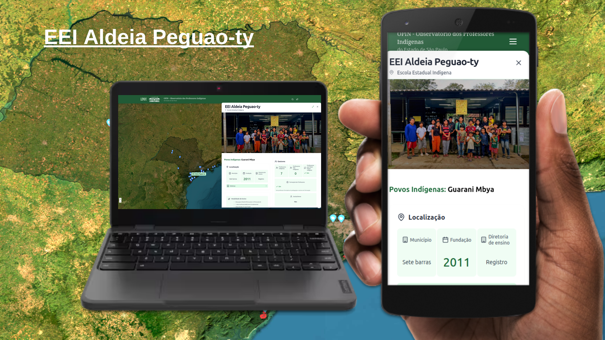

# OPIN - Observatório dos Professores Indígenas no Estado de São Paulo

O OPIN (Observatório dos Professores Indígenas no Estado de São Paulo) é um site que mapeia e apresenta informações detalhadas sobre escolas indígenas no estado de São Paulo, Brasil. É parte do projeto "Ação Saberes Indígenas nas Escolas" realizado pela LINDI/UNIFESP em 2025. A plataforma visa mapear, documentar e compartilhar informações sobre as escolas indígenas, suas características, desafios e conquistas, fortalecendo a educação diferenciada e intercultural.


**Site:** https://hericmr.github.io/escolasindigenas/

---

## Screenshots




---

### Funcionalidades

- **Mapa Interativo**: Visualização geográfica das escolas indígenas
- **Painel de Informações**: Dados completos sobre cada escola
- **Painel Administrativo**: Interface para gerenciamento de dados
- **Busca**: Pesquisa por localização e características
- **Materiais Didáticos**: Recursos educacionais (em construção)

---

## Estrutura do Mapa Dinâmico

Mapa interativo com base em imagem de satélite e três camadas principais:

### Camadas
1. **Estado de São Paulo** - Limites administrativos e divisão municipal
2. **Terras Indígenas** - Demarcação oficial das áreas protegidas  
3. **Escolas Indígenas** - Marcadores com informações detalhadas

### Funcionalidades
- Zoom e navegação livre
- Controles de camadas
- Busca geográfica
- Painel lateral com dados completos

---

## Guia do Administrador

### Painel de Administração (`/admin`)

Acesse o painel administrativo para gerenciar todas as informações das escolas através de abas organizadas:

#### Abas Principais
- **Dados Básicos**: Nome, município, endereço, terra indígena, diretoria
- **Povos**: Povos indígenas e línguas faladas
- **Modalidades**: Ensino, alunos, turnos de funcionamento
- **Infraestrutura**: Estrutura física, água, internet, equipamentos, cozinha, merenda escolar
- **Gestores**: Direção, professores, formação profissional
- **Material Pedagógico**: PPP próprio e com comunidade
- **Projetos**: Parcerias, ONGs, desejos da comunidade
- **Redes Sociais**: Links e uso de redes sociais
- **Vídeo**: Links para vídeos da escola
- **Histórias**: História da escola
- **História dos Professores**: Sistema para múltiplos professores
- **Coordenadas**: Latitude e longitude
- **Imagens**: Upload de fotos da escola e professores
- **Documentos**: Gerenciamento de PDFs

---

### Redes Sociais Suportadas

- **Facebook**: Open Graph tags com título, descrição e imagem customizados
- **WhatsApp**: Compatível com Open Graph (mesmas tags do Facebook)
- **LinkedIn**: Open Graph tags otimizadas para profissionais
- **Twitter/X**: Twitter Cards com informações específicas da escola
- **Telegram**: Open Graph tags para previews ricos
- **Google Search**: Meta tags SEO e dados estruturados (JSON-LD)

### Como Funciona

1. **Detecção Automática**: O sistema detecta automaticamente qual escola está sendo visualizada via parâmetro `panel` na URL
2. **Meta Tags Customizadas**: Gera título, descrição e URL específicos para cada escola
3. **Compartilhamento Rico**: Quando compartilhada nas redes sociais, a URL mostra um snippet atrativo com informações específicas da escola

#### Exemplo de Meta Tags Customizadas


#### Resultado no Compartilhamento Social


---

## Estrutura do Banco de Dados

### Tabela Principal: `escolas_completa`

```sql
-- Campos principais
id (int, primary key)
Escola (text) -- Nome da escola
Município (text)
Endereço (text)
Terra Indigena (TI) (text)
Povos indigenas (text)
Linguas faladas (text)
Modalidade de Ensino/turnos de funcionamento (text)
Numero de alunos (text)
Espaço escolar e estrutura (text)
Gestão/Nome (text)
Quantidade de professores indígenas (text)
Quantidade de professores não indígenas (text)
historia_da_escola (text)
latitude (numeric)
longitude (numeric)
link_para_videos (text)

-- Campos de infraestrutura
cozinha (text) -- Ex: "Sim", "Não", "Em construção"
merenda_escolar (text) -- Ex: "Sim", "Não", "Parcial"
diferenciada (text) -- Ex: "Sim", "Não", "Específica"
merenda_diferenciada (text) -- Detalhes sobre a merenda

-- Campos de endereço detalhado
logradouro (text)
numero (text)
complemento (text)
bairro (text)
cep (text)
estado (text, default 'SP')
```

### Tabela: `historias_professor`

```sql
id (int, primary key)
escola_id (int, foreign key)
nome_professor (text, NOT NULL)
historia (text, NOT NULL)
ordem (int, default 1)
ativo (boolean, default true)
foto_rosto (text, nullable) -- URL da foto de rosto do professor
created_at (timestamp)
updated_at (timestamp)
```

### Tabela: `documentos_escola`

```sql
id (int, primary key)
escola_id (int, foreign key)
titulo (text, NOT NULL)
autoria (text)
tipo (text)
link_pdf (text, NOT NULL)
created_at (timestamp)
```

### Tabelas de Imagens
- `escola_images`: Imagens da escola com legendas
- `professor_images`: Imagens dos professores com legendas

---

## Funcionalidades Especiais

### Sistema de Vídeos
- Suporte a YouTube, Vimeo e outras plataformas
- Pré-visualização automática
- Títulos editáveis

### Gerenciamento de Imagens
- Upload direto via interface administrativa
- Legendas editáveis em tempo real
- Organização por escola e professor

### Histórias dos Professores
- Sistema independente para cada professor
- Ordenação personalizável
- Ativação/desativação de histórias
- Upload de fotos de rosto

---

## Tecnologias Utilizadas

### Frontend
- **React 18** - Biblioteca principal para interface
- **TailwindCSS** - Framework CSS para estilização
- **Lucide React** - Biblioteca de ícones
- **OpenLayers** - Mapas interativos de alta performance
- **Framer Motion** - Animações e transições
- **React Router** - Roteamento de páginas
- **React Helmet Async** - Gerenciamento de meta tags

### Backend e Dados
- **Supabase** - Backend como serviço e banco de dados
- **GeoJSON** - Formato para dados geográficos
- **PapaParse** - Parser para arquivos CSV
- **React Markdown** - Renderização de conteúdo markdown

### Deploy e Hospedagem
- **GitHub Pages** - Hospedagem estática
- **GitHub Actions** - CI/CD automático

---

## Instalação e Desenvolvimento

### Pré-requisitos
- Node.js 16 ou superior
- npm ou yarn
- Conta no Supabase

### Instalação

1. Clone o repositório:
```bash
git clone https://github.com/hericmr/escolasindigenas.git
cd escolasindigenas
```

2. Instale as dependências:
```bash
npm install
```

3. Configure as variáveis de ambiente:
```bash
cp .env.example .env.local
# Edite .env.local com suas credenciais do Supabase
```

4. Inicie o servidor de desenvolvimento:
```bash
npm start
```

### Comandos Disponíveis

```bash
npm start      # Iniciar servidor de desenvolvimento
npm run build  # Build para produção
npm run deploy # Deploy no GitHub Pages
npm test       # Executar testes
npm run lint   # Verificar código com ESLint
```

---

## Estrutura do Projeto

```
src/
├── components/
│   ├── MetaTags/              # Sistema de meta tags dinâmicas
│   ├── PainelInformacoes/     # Informações detalhadas das escolas
│   ├── MapaEscolasIndigenas/  # Mapa interativo principal
│   ├── AdminPanel/            # Painel de administração
│   ├── Navbar/                # Barra de navegação
│   ├── SearchResults/         # Resultados de busca
│   └── ...
├── hooks/                     # Hooks personalizados
│   ├── useEscolasData.js      # Hook para dados das escolas
│   ├── useEscolaAtual.js      # Hook para detecção de escola atual
│   └── useMetaTags.js         # Hook para meta tags
├── services/                  # Serviços de API
├── utils/                     # Utilitários e helpers
├── config/                    # Configurações
└── App.js                     # Componente raiz
```

---

## Configuração do Supabase

### Permissões Necessárias

```sql
-- Liberar permissões para histórias dos professores
GRANT ALL ON TABLE historias_professor TO authenticated;
GRANT ALL ON TABLE historias_professor TO anon;

-- Liberar permissões para documentos
GRANT ALL ON TABLE documentos_escola TO authenticated;
GRANT ALL ON TABLE documentos_escola TO anon;

-- Liberar permissões para imagens
GRANT ALL ON TABLE escola_images TO authenticated;
GRANT ALL ON TABLE escola_images TO anon;
GRANT ALL ON TABLE professor_images TO authenticated;
GRANT ALL ON TABLE professor_images TO anon;
```

### Políticas de Segurança (RLS)

Configure as políticas de Row Level Security (RLS) conforme necessário para controlar acesso aos dados.

---

## Campos Obrigatórios

### Para Funcionamento do Mapa
- **Latitude** e **Longitude**: Essenciais para posicionamento dos marcadores
- **Nome da escola**: Exibido no popup do marcador
- **Município**: Informação básica para identificação

### Para Funcionamento do Sistema
- **Nome da escola** (Dados Básicos)
- **Nome do professor** (História dos Professores)
- **História do professor** (História dos Professores)
- **Título e link do documento** (Documentos)

---

## Boas Práticas

### Dados
- Use links do Google Drive para documentos (com permissão pública)
- Mantenha histórias dos professores organizadas por ordem
- Verifique coordenadas antes de salvar
- Teste links de vídeo antes de salvar

### Desenvolvimento
- Mantenha componentes modulares e reutilizáveis
- Use TypeScript para melhor tipagem (quando aplicável)
- Documente componentes complexos
- Teste funcionalidades em diferentes navegadores

### SEO e Compartilhamento
- Verifique meta tags com ferramentas de debug das redes sociais
- Mantenha URLs limpas e descritivas
- Otimize imagens para web
- Teste compartilhamento em diferentes plataformas

---

## Solução de Problemas

### Formulário não salva
- Verifique campos obrigatórios
- Confirme erros no console do navegador
- Verifique permissões no Supabase
- Teste conexão com internet

### Imagens não carregam
- Verifique se o arquivo não excede 5MB
- Confirme formato suportado (JPG, PNG, GIF)
- Verifique conexão com internet
- Confirme URL da imagem

### Meta tags não aparecem
- Verifique se HelmetProvider está configurado
- Confirme se MetaTagsDetector está sendo renderizado
- Teste com ferramentas de debug das redes sociais
- Verifique se escola não é null/undefined

### Mapa não carrega
- Verifique coordenadas válidas
- Confirme dados no formato correto
- Teste conexão com Supabase
- Verifique console para erros JavaScript

---

## Contribuição

Para contribuir com o projeto:

1. Faça um fork do repositório
2. Crie uma branch para sua feature (`git checkout -b feature/nova-funcionalidade`)
3. Commit suas mudanças (`git commit -m 'Adiciona nova funcionalidade'`)
4. Push para a branch (`git push origin feature/nova-funcionalidade`)
5. Abra um Pull Request

---

## Licença

Este projeto está sob a licença MIT. Veja o arquivo [LICENSE](LICENSE) para mais detalhes.

---

## Contato

Para dúvidas ou sugestões sobre o projeto, entre em contato através dos issues do GitHub ou pelo email do desenvolvedor.

---

## Changelog

### Versão Atual
- Sistema de meta tags customizadas para compartilhamento social
- Detecção automática de escola via URL
- Suporte completo para Facebook, WhatsApp, LinkedIn, Twitter
- Melhorias no painel administrativo
- Otimizações de performance
- Sistema de busca aprimorado
