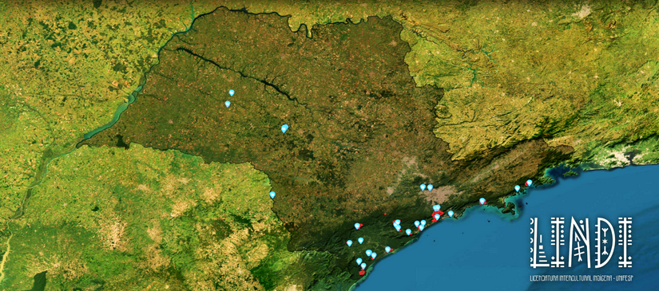

# OPIN - Observatório dos Professores Indígenas no Estado de São Paulo

O OPIN (Observatório dos Professores Indígenas no Estado de São Paulo) é um site que mapeia as escolas indígenas no estado de São Paulo. Feito durante o projeto "Ação Saberes Indígenas nas Escolas", da LINDI/UNIFESP (2025), o site documenta dados sobre essas escolas, destacando suas realidades, histórias e práticas pedagógicas. Os diagnósticos foram feitos pelos próprios professores indígenas das escolas.




**Site:** https://hericmr.github.io/opin/

---

## Screenshots


## Funcionalidades

- **Mapa Interativo**: Visualização geográfica das escolas indígenas
- **Painel de Informações**: Dados completos sobre cada escola
- **Painel Administrativo**: Interface para gerenciamento de dados
- **Busca**: Pesquisa por localização e características
- **Materiais Didáticos**: Recursos educacionais (em construção)


## Estrutura do Mapa Dinâmico

Mapa interativo com base em imagem de satélite e três camadas principais:

### Camadas
1. **Estado de São Paulo** - Limites administrativos e divisão municipal
2. **Terras Indígenas** - Demarcação oficial das áreas protegidas  
3. **Escolas Indígenas** - Marcadores com informações detalhadas

### Funcionalidades
- Zoom e navegação livre
- Controles de camadas
- Busca geográfica
- Painel lateral com dados completos


---

## Tecnologias

- **React 19** - Biblioteca JavaScript para interfaces (atualizado de React 18)
- **Vite** - Build tool e dev server (migrado de Create React App)
- **Tailwind CSS 4** - Framework CSS utilitário (atualizado de Tailwind 3)
- **OpenLayers** - Biblioteca para mapas interativos
- **Banco de Dados Local** - PostgreSQL (anteriormente Supabase)
- **Jest** - Framework de testes

## Imagens e Armazenamento

O projeto utiliza um sistema híbrido para imagens:
- **Imagens Locais**: Imagens pré-existentes são servidas da pasta `public/images/local` para performance e disponibilidade offline.
- **Novos Uploads**: Novas imagens adicionadas pelo painel administrativo são enviadas para o Supabase.

Para sincronizar novas imagens do Supabase para o local (em ambiente de desenvolvimento):
```bash
node scripts/download_images.js
```
Isso baixa as novas imagens e atualiza o `src/data/image_map.json`.

## Ambiente Docker

Para facilitar o desenvolvimento local, o projeto oferece suporte a contêineres Docker, incluindo banco de dados (PostgreSQL), API (PostgREST) e front-end.

### Pré-requisitos
- Docker Desktop ou Docker Engine + Docker Compose

### Comandos Rápidos
O projeto inclui um `Makefile` para facilitar os comandos mais comuns:

- **Iniciar o ambiente**: `make up` (ou `make up-d` para rodar em background)
  - Acesse o site em: http://localhost:8080/opin/
  - API disponível em: http://localhost:8080/opin/rest/v1/

- **Parar o ambiente**: `make down`

- **Resetar banco de dados**: `make reset-db`
  - Isso **apaga** todos os dados locais e reinicia o banco a partir do dump SQL original. Use com cuidado!

- **Ver logs**: `make logs-f`

## Documentação

### Para Desenvolvedores
Se você quer clonar este repositório e executar o projeto localmente:

**[Guia para Instalação](Guia%20para%20Instalação.md)**

### Migrações Realizadas

Este projeto passou por duas migrações importantes:

1. **Migração para Vite** (2024-12): Migrado de `react-scripts` (Create React App) para **Vite** para melhorar performance, reduzir dependências e permitir atualizações futuras.

2. **Migração para React 19 e Tailwind CSS 4** (2025-11): Atualizado para **React 19** e **Tailwind CSS 4** para aproveitar as últimas features e melhorias de performance. Build time melhorou em ~14% (8.94s → 7.69s).

Veja [planning.md](planning.md) para detalhes completos das migrações.

### Para Administradores
Se você é administrador do OPIN e tem alguma dúvida, provavelmente ela será respondida nesta documentação:

**[Guia do Administrador](docs/GUIA_ADMINISTRADOR.md)**


---

## Estrutura do Projeto

```
src/
├── components/
│   ├── MetaTags/              # Sistema de meta tags dinâmicas
│   ├── PainelInformacoes/     # Informações detalhadas das escolas
│   ├── MapaEscolasIndigenas/  # Mapa interativo principal
│   ├── AdminPanel/            # Painel de administração
│   ├── Navbar/                # Barra de navegação
│   ├── SearchResults/         # Resultados de busca
│   └── ...
├── hooks/                     # Hooks personalizados
│   ├── useEscolasData.js      # Hook para dados das escolas
│   ├── useEscolaAtual.js      # Hook para detecção de escola atual
│   └── useMetaTags.js         # Hook para meta tags
├── services/                  # Serviços de API
├── utils/                     # Utilitários e helpers
├── config/                    # Configurações
└── App.js                     # Componente raiz
```

---

## Contribuição

Para contribuir com o projeto:

1. Faça um fork do repositório
2. Crie uma branch para sua feature (`git checkout -b feature/nova-funcionalidade`)
3. Commit suas mudanças (`git commit -m 'Adiciona nova funcionalidade'`)
4. Push para a branch (`git push origin feature/nova-funcionalidade`)
5. Abra um Pull Request

---

## Licença

Este projeto está sob a licença MIT. Veja o arquivo [LICENSE](LICENSE) para mais detalhes.

---

## Contato

**GitHub**

Feel free to contact me at heric.moura@unifesp.br.

Para dúvidas ou sugestões sobre o projeto, entre em contato através dos issues do GitHub ou pelo email do desenvolvedor.
